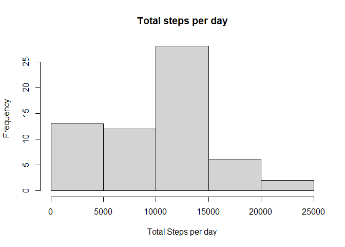
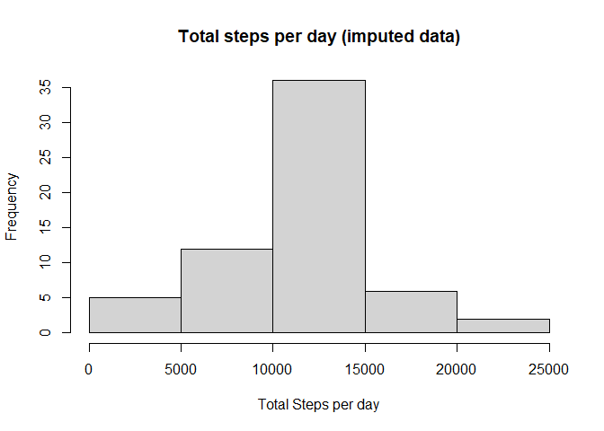
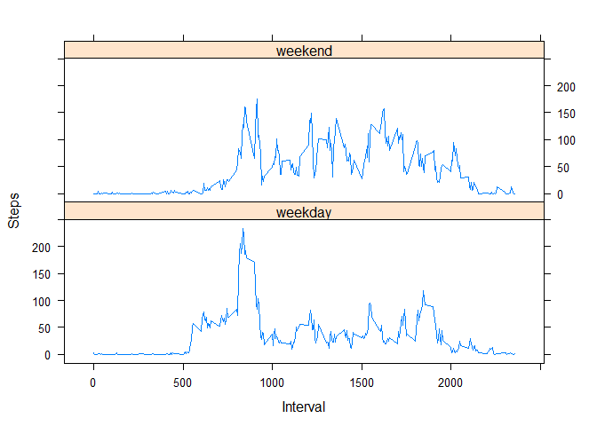

## Importing some useful libraries

```r
library(plyr)
library(dplyr)
```


## Loading and preprocessing the data


```r
activity <- read.csv('./data/activity.csv')
steps_per_day <-  activity %>%
    group_by(date) %>%
    summarise_at(vars(steps),sum,na.rm=TRUE) 

hist(steps_per_day$steps,xlab="Total Steps per day",main="Total steps per day")
```

<!-- -->


## What is mean total number of steps taken per day?

```r
paste("Mean of total steps perday:",mean(steps_per_day$steps,na.rm = TRUE));paste("Median of total steps per day:",median(steps_per_day$steps,na.rm = TRUE))
```

```
## [1] "Mean of total steps perday: 9354.22950819672"
```

```
## [1] "Median of total steps per day: 10395"
```


## What is the average daily activity pattern?

```r
activity_pattern <- 
    activity %>%
        group_by(interval) %>%
        summarize_at(vars(steps),mean,na.rm=TRUE)
plot(activity_pattern,type='l')
```

<!-- -->
The most activity, on average, is in the interval `{r}activity_pattern[which.max(activity_pattern$steps),'interval'] %>% as.numeric `.


## Imputing missing values

```r
num_of_na = sum(is.na(activity$steps))
```
There are `{r}num_of_na` missing values.
We are imputing them as the mean of the same intervall.

```r
impute <- function(x) {
    if (is.na(x['steps'])) {
      #only impute NAs
      x['steps'] <-
        activity_pattern[activity_pattern$interval == as.numeric(x['interval']), "steps"] %>% as.numeric
    }
    return(x)
}
imputed_activity <- adply(activity,1,impute)
imputed_steps_per_day <-  imputed_activity %>%
    group_by(date) %>%
    summarise_at(vars(steps),sum,na.rm=TRUE) 

hist(imputed_steps_per_day$steps,xlab="Total Steps per day",main="Total steps per day (imputed data)")
```

<!-- -->
Comparing the imputed data with the original data containing missing values we find that the mean and median both increased, but that the increase in the mean was bigger.

```r
data.frame(mean=c(mean(steps_per_day$steps,na.rm = TRUE),mean(imputed_steps_per_day$steps,na.rm = TRUE)),median = c(median(steps_per_day$steps,na.rm = TRUE),median(imputed_steps_per_day$steps,na.rm = TRUE)),row.names = c("Missing Values","Imputed Data"))
```

```
##                    mean   median
## Missing Values  9354.23 10395.00
## Imputed Data   10766.19 10766.19
```


## Are there differences in activity patterns between weekdays and weekends?

```r
library(lattice)
is_weekend <- function(x){
  if (x == "Sat" | x == "Sun"){
    "weekend"
  }
  else{
    "weekday"
  }
}
activity$weekend <-  
  activity$date %>%
  as.Date %>%
  weekdays(abbreviate = TRUE) %>%
  sapply(FUN=is_weekend) %>%
  as.factor

df <- activity %>% 
  group_by(weekend,interval) %>%
  summarise_at(vars(steps),mean,na.rm=TRUE)
  
xyplot(df$steps~df$interval|df$weekend,type='l',layout=c(1,2),ylab="Steps",xlab="Interval")
```

<!-- -->


